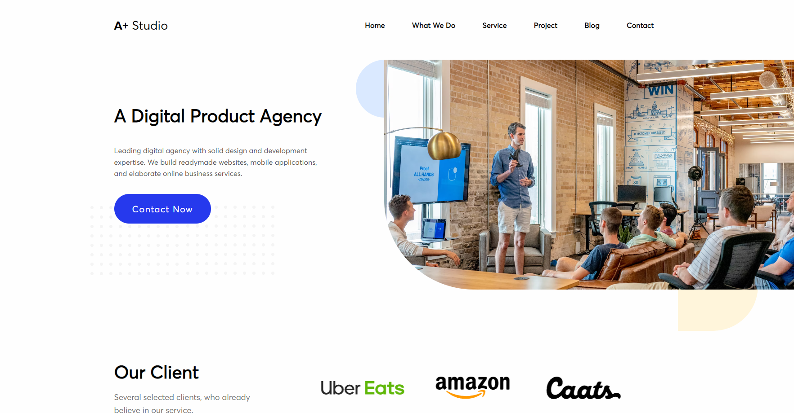

# Studio Design Landing Page

A front end exercise done during my training at [BeCode](https://becode.org/all-trainings/pedagogical-framework-junior-developer/).

## The Goal

Applying everything we learned so far to build a web page:
- SASS
- Media queries
- Background images
- before and after content
- Libraries
- Modals
- Form validation

## What does it look like ?

Check the result ➡️ [here](https://dystrima.github.io/Studio-Design-Landin-Page/) ⬅️

